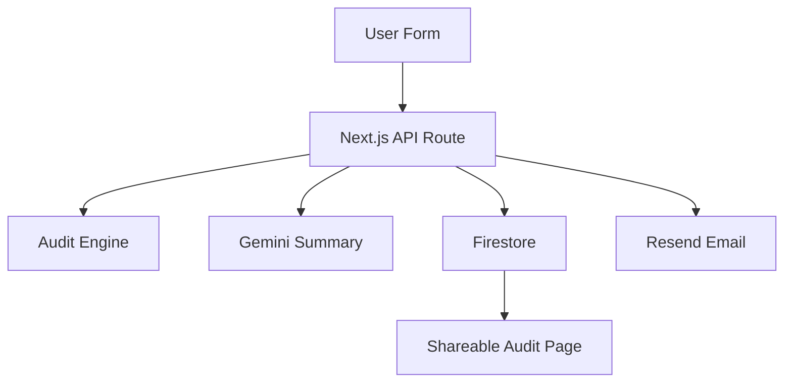

## A. System Diagram

---

## B. Data Flow

Example:

1. User fills AI tools + email form
2. Frontend sends POST request to `/api/audit`
3. API route validates inputs
4. Audit engine calculates recommendations
5. Gemini generates personalized summary
6. Result stored in Firestore
7. Email sent with audit confirmation
8. User redirected to public shareable audit URL

## Why this stack

- **Next.js**  
  Used Next.js because it supports both frontend and backend in one codebase. API routes made it easy to handle audit generation, Firestore storage, and email sending while deploying seamlessly on Vercel.

- **TypeScript**  
  Used TypeScript for type safety across forms, pricing logic, and API responses. It helped catch invalid tool inputs and reduced runtime bugs during development.

- **Tailwind CSS**  
  Used Tailwind for fast UI development and responsive layouts. It made it easy to build polished components quickly without writing custom CSS files.

- **Firebase (Firestore + Admin SDK)**  
  Used Firestore as the backend database to store audits and lead capture data. It was simple to integrate and worked well for generating shareable public audit result pages.

- **Gemini API**  
  Used Gemini Flash to generate personalized audit summaries. It has a generous free tier and integrated well with the audit pipeline.

- **Resend**  
  Used Resend for transactional emails after report generation. It was quick to configure and reliable for sending confirmation emails with minimal setup.